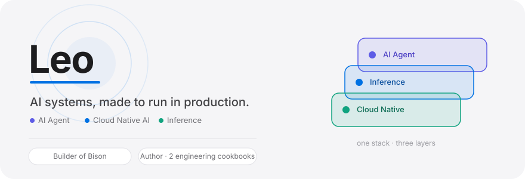
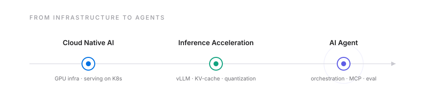

  <b>EN</b>&nbsp;&nbsp;⇄&nbsp;&nbsp;<a href="./README_CN.md">中文</a>

<picture>
  <source media="(prefers-color-scheme: dark)" srcset="./assets/hero-rich-dark.svg">
  <source media="(prefers-color-scheme: light)" srcset="./assets/hero-rich-light.svg">
  
</picture>

I build the infra that makes LLM agents reliable in production — inference serving, MCP tool layers, multi-agent orchestration, and eval/observability.

<h2> How my agents run</h2>

<picture>
  <source media="(prefers-color-scheme: dark)" srcset="./assets/atlas-dark.svg">
  <source media="(prefers-color-scheme: light)" srcset="./assets/atlas-light.svg">
  
</picture>

Every tool call and LLM span is traced; guardrails gate actions; eval feedback closes the loop — agents as observable, cost-bounded systems on a cloud-native substrate.

<h2> Capabilities</h2>

<picture>
  <source media="(prefers-color-scheme: dark)" srcset="./assets/capdive-dark.svg">
  <source media="(prefers-color-scheme: light)" srcset="./assets/capdive-light.svg">
  
</picture>

<h2> Tech stack</h2>

<picture>
  <source media="(prefers-color-scheme: dark)" srcset="./assets/techpano-dark.svg">
  <source media="(prefers-color-scheme: light)" srcset="./assets/techpano-light.svg">
  
</picture>

<h2> Journey</h2>

<picture>
  <source media="(prefers-color-scheme: dark)" srcset="./assets/journey-dark.svg">
  <source media="(prefers-color-scheme: light)" srcset="./assets/journey-light.svg">
  
</picture>

<h2> Selected work</h2>

- [**Bison**](http://bison.lei6393.com/) — Enterprise GPU billing & multi-tenant platform
- [**Inference Cookbook**](https://inference.lei6393.com/) — Inference frameworks, deep-dived
- [**Cloud Native Cookbook**](https://cloudnative.lei6393.com/) — Cloud-native engineering, deep-dived

 

<picture>
  <source media="(prefers-color-scheme: dark)" srcset="./assets/footer-banner-dark.svg">
  <source media="(prefers-color-scheme: light)" srcset="./assets/footer-banner-light.svg">
  
</picture>

  
  
  
  

