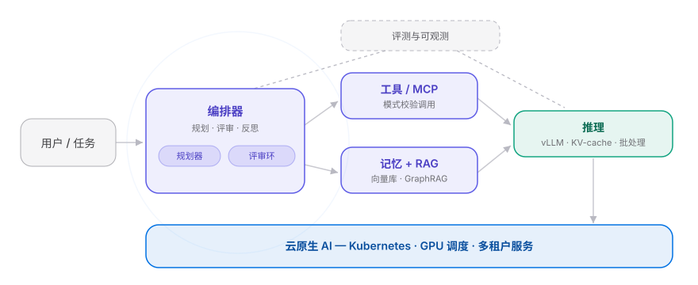
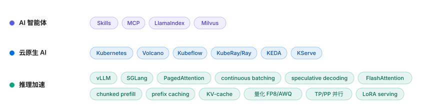
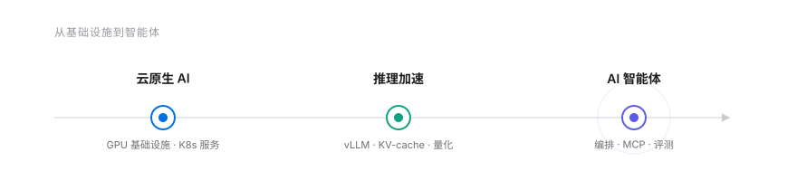

  <a href="./README.md">EN</a>&nbsp;&nbsp;⇄&nbsp;&nbsp;<b>中文</b>

<picture>
  <source media="(prefers-color-scheme: dark)" srcset="./assets/hero-rich-cn-dark.svg">
  <source media="(prefers-color-scheme: light)" srcset="./assets/hero-rich-cn-light.svg">
  
</picture>

我构建让大模型智能体稳定上生产的基础设施 —— 推理服务、MCP 工具层、多智能体编排,以及评测与可观测。

<h2> 智能体如何运行</h2>

<picture>
  <source media="(prefers-color-scheme: dark)" srcset="./assets/atlas-cn-dark.svg">
  <source media="(prefers-color-scheme: light)" srcset="./assets/atlas-cn-light.svg">
  
</picture>

每一次工具调用与大模型调用都被追踪,护栏拦截动作,评测反馈形成闭环 —— 把智能体当作运行在云原生底座上、可观测且成本可控的系统。

<h2> 核心能力</h2>

<picture>
  <source media="(prefers-color-scheme: dark)" srcset="./assets/capdive-cn-dark.svg">
  <source media="(prefers-color-scheme: light)" srcset="./assets/capdive-cn-light.svg">
  
</picture>

<h2> 技术栈</h2>

<picture>
  <source media="(prefers-color-scheme: dark)" srcset="./assets/techpano-cn-dark.svg">
  <source media="(prefers-color-scheme: light)" srcset="./assets/techpano-cn-light.svg">
  
</picture>

<h2> 成长轨迹</h2>

<picture>
  <source media="(prefers-color-scheme: dark)" srcset="./assets/journey-cn-dark.svg">
  <source media="(prefers-color-scheme: light)" srcset="./assets/journey-cn-light.svg">
  
</picture>

<h2> 精选作品</h2>

- [**Bison**](http://bison.lei6393.com/) —— 企业级 GPU 计费与多租户管理平台
- [**Inference Cookbook**](https://inference.lei6393.com/) —— 推理框架原理深度解析
- [**Cloud Native Cookbook**](https://cloudnative.lei6393.com/) —— 云原生工程原理深度解析

 

<picture>
  <source media="(prefers-color-scheme: dark)" srcset="./assets/footer-banner-dark.svg">
  <source media="(prefers-color-scheme: light)" srcset="./assets/footer-banner-light.svg">
  
</picture>

  
  
  
  

